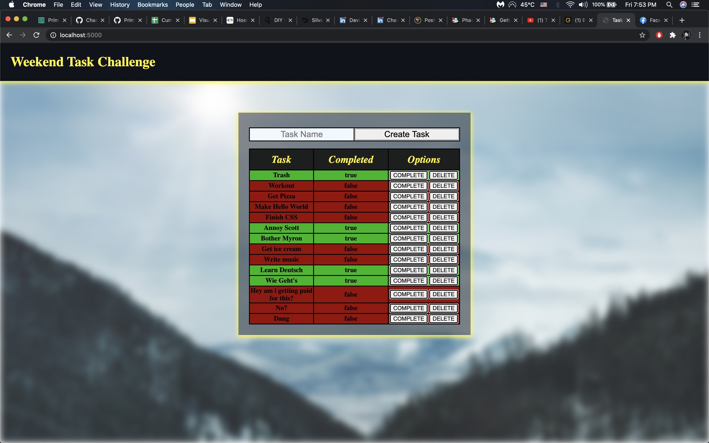

# WEEKEND SQL TO-DO LIST

## Description

Time : 10 hours

This is a project is a task tracker, a task can be added via the input field, store to a database, were upon completion you can update the task to reflect that. Once the task is no longer needed it can also be deleted.

## Screen Shot

## Installation

1. Create a database named `weekend-to-do-app`,
2. The queries in the `database.sql` file are set up to create all the necessary tables and populate the needed data to allow the application to run correctly. The project is built on [Postgres](https://www.postgresql.org/download/), so you will need to make sure to have that installed. We recommend using Postico to run those queries as that was used to create the queries,
3. Open up your editor of choice and run an `npm install || npm i`
4. Run `node server/server.js` in your terminal
5. Open Google Chrome and connect to `localhost:5000`

## Usage

How does someone use this application? Tell a user story here.

1. Insert a task name into the input field, and create
2. Go off and complete your task, and then mark it on the tracker by clicking the COMPLETE button
3. If the task is no longer needed to be tracked you can delete it by clicking the DELETE button

## Built With

"express": "^4.17.1",
"node": "^15.0.1",
"pg": "^8.4.1"

## License

[MIT](https://choosealicense.com/licenses/mit/)

_Note, include this only if you have a license file. GitHub will generate one for you if you want!_

## Acknowledgement

Thanks to [Prime Digital Academy](www.primeacademy.io) who equipped and helped me to make this application a reality. (Thank your people)

## Support

If you have suggestions or issues, please email me at [youremail@whatever.com](www.google.com)
